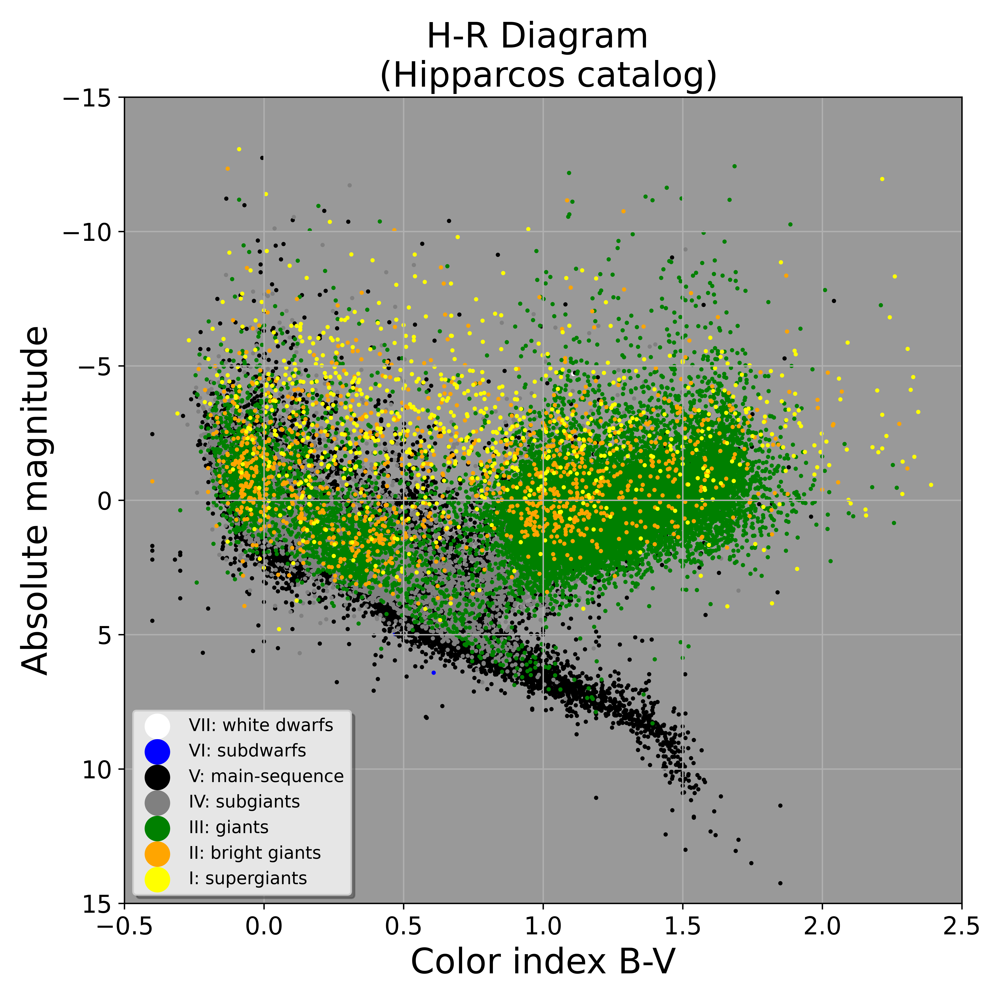

# 🌟 Stellar Classification Using Machine Learning

This project applies machine learning to classify stars based on their physical properties. A supervised ML model is trained on data from the **Hipparcos catalog**, and then applied to the **Gaia DR3** dataset to predict stellar types. The results are visualized using Hertzsprung–Russell (H-R) diagrams.

---

## 📁 Datasets

### 🔹 Training Dataset: **Hipparcos Catalog**
- Source: [Wikipedia](https://en.wikipedia.org/wiki/Hipparcos) / [VizieR Catalog I/239](http://vizier.u-strasbg.fr/viz-bin/VizieR?-source=I/239)
- Download Instructions:
  1. Go to the VizieR link above
  2. Select fields: `HIP`, `Vmag`, `Plx`, `BV`, `SpType`
  3. Under **Preferences**: choose `;-Separated Values` and set format to **unlimited**
  4. Click **Submit** and download the file
  5. Save as `I_239_selection.tsv`

### 🔹 Prediction Dataset: **Gaia DR3**
- Source: [ESA Gaia Archive](https://gea.esac.esa.int/archive/)
- A curated Gaia DR3 subset was used with the necessary columns like:
  - `RA`, `DEC`, `Plx`, `pmra`, `pmdec`, `B-V`, `Vmag`

---

## 🧠 Machine Learning Pipeline

1. **Data Cleaning**:
   - Handle whitespace, missing values, and invalid entries
2. **Feature Engineering**:
   - Compute absolute magnitude:  
     $$
     M_V = V_{\text{mag}} + 5 \log_{10} \left( \frac{\text{Plx}}{100} \right)
     $$
   - Color index: `B–V`
   - Spectral Type to numerical representation
3. **Model Training**:
   - Trained with `scikit-learn` classifiers (e.g., DecisionTree, RandomForest)
   - Target: **Luminosity class** derived from `SpType`
   - Note: **This project does not use class balancing techniques**
4. **Prediction**:
   - Apply trained model to Gaia DR3 dataset
   - Add predicted `type` column

---

## 🌌 Visualization

- Creates an **H-R diagram** (Absolute Magnitude vs. B–V Color Index)
- Uses **Seaborn** to color-code by predicted stellar type
- Grey background for visual clarity
- Excludes "Unclassified" stars from the final plot

---

## 📊 Example Plot

 <!-- Optional: Replace with actual plot -->

---
## Get started

